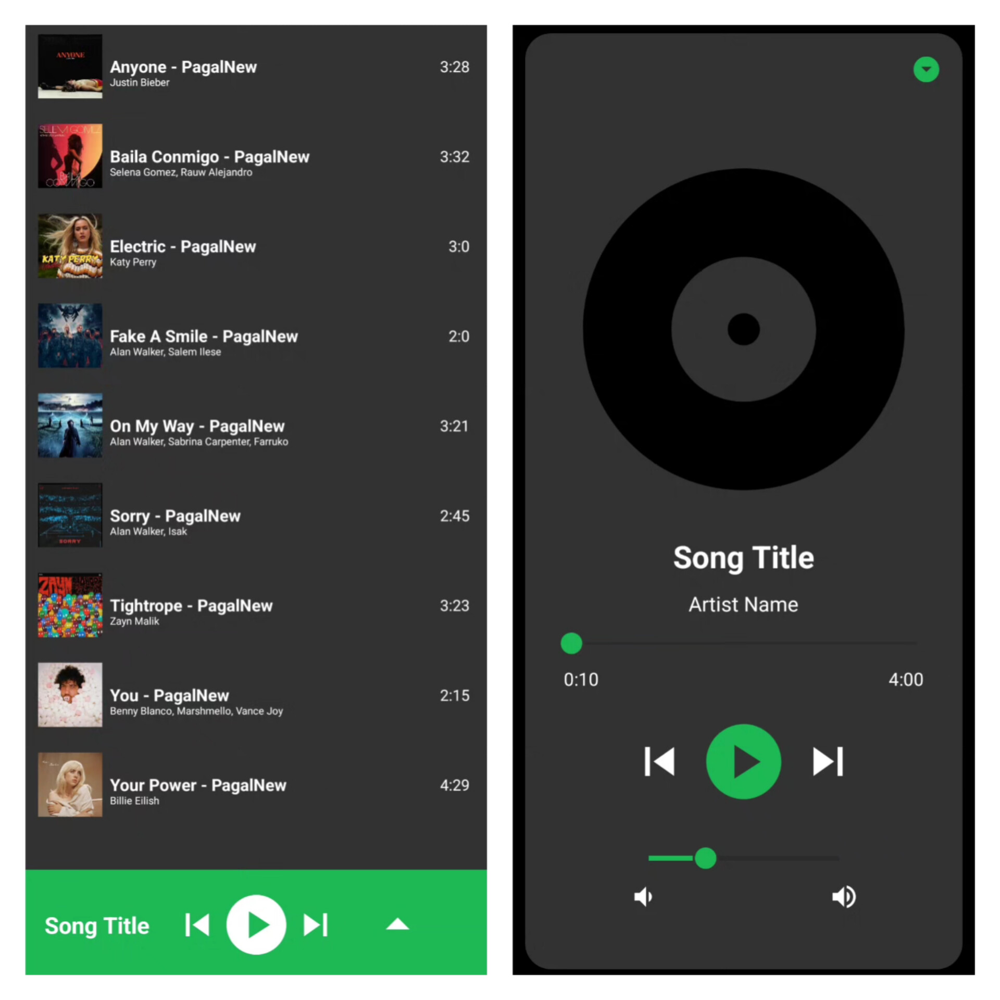
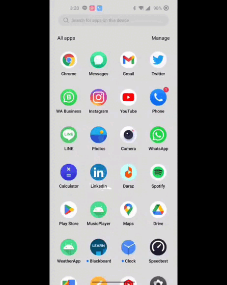

### Music Player - Kotlin | MVVM | Audio Focus 

#### YouTue Tutorial: https://www.youtube.com/watch?v=AHG8q3_IUO4&list=PLKETiCsEsH0qmGpPcnMgN_bGNGszYaqAG

#### Features 

1. Leveraging one music player instance among all the views
2. Auto switch to next song 
3. Seekbar for song progress and volume control
4. Audio focus
5. Raw asset permissions

##### APP DEMO

#### Developed by Developer Sam 2023© For collabartion or feedback write me dev.samakram@gmail.com
